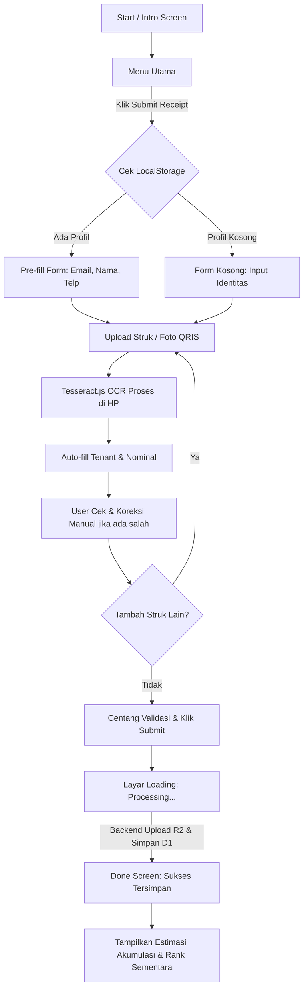
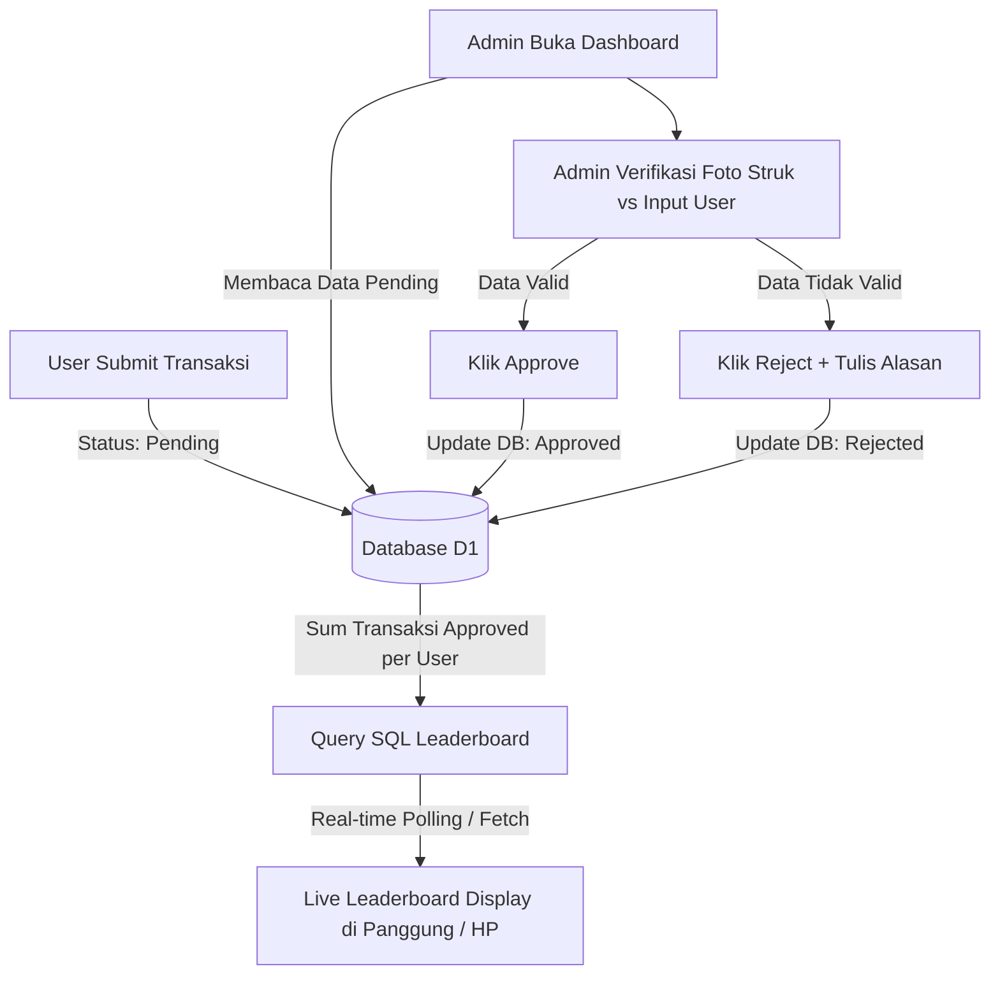

# Product Requirements Document (PRD)
## EXPOSURE 2026 Spender Leaderboard Web Application

---

## 1. Pendahuluan & Latar Belakang

**EXPOSURE Solstice 2026** adalah acara perbelanjaan di mana para pengunjung (peserta) berbelanja di berbagai tenant yang berpartisipasi. Untuk memeriahkan acara dan mendorong antusiasme berbelanja, diselenggarakan program **Spender Leaderboard** (Papan Peringkat Pembelanja Terbanyak) dengan berbagai hadiah menarik (*Grand Prize*).

Aplikasi web ini dirancang sebagai platform terintegrasi tanpa login bagi peserta untuk mengunggah bukti transaksi QRIS secara langsung, yang secara otomatis dipindai oleh OCR untuk mengisi formulir, dan divalidasi oleh panitia (admin) sebelum secara real-time masuk ke papan peringkat (*live leaderboard*).

---

## 2. Arsitektur Sistem & Stack Teknologi

Aplikasi ini menggunakan arsitektur **Monorepo** untuk menyederhanakan kolaborasi tim, pengembangan, dan deployment otomatis pada infrastruktur Cloudflare.

```text
/exposure-leaderboard
├── frontend/       # Next.js + Tailwind CSS (Hosted di Cloudflare Pages)
├── backend/        # Cloudflare Workers + Hono.js + D1 Database
└── package.json    # Workspaces & Config
```

* **Frontend**: **Next.js (App Router)** & **Tailwind CSS**. Mengutamakan pendekatan mobile-first untuk peserta (karena pengunggahan struk dilakukan di HP di lokasi acara) dan desktop-optimized untuk halaman Admin Dashboard & Live Display Monitor di panggung utama.
* **Backend API**: **Cloudflare Workers** dengan framework **Hono.js** (TypeScript).
* **Database**: **Cloudflare D1** (Serverless SQL Database berbasis SQLite).
* **Storage Bukti Struk**: **Cloudflare R2** (S3-compatible Object Storage tanpa biaya egress untuk penyimpanan gambar struk terkompresi).
* **State & Caching Lokal**: `localStorage` browser untuk menyimpan profil peserta guna mengeliminasi sistem login tradisional.

---

## 3. Fitur Utama & Kebutuhan Fungsional

### 3.1. Sisi Peserta (User Interface - Mobile & Desktop)

#### A. Alur Splash & Menu Utama
1. **Start Screen**: Menampilkan animasi latar langit awan pastel yang bergerak perlahan.
2. **Intro Screen**: Menampilkan logo "EXPOSURE Solstice 2026" di tengah layar, dengan transisi memudar halus (*fade out*).
3. **Menu Screen**:
   * Menampilkan visual hadiah utama (*Grand Prize*).
   * Tombol **"SPENDING LEADERBOARD"** untuk melihat peringkat.
   * Tombol **"SUBMIT YOUR RECEIPT"** untuk mengisi form transaksi.

#### B. Formulir Pengunggahan Bukti Transaksi (`/submit`)
1. **Kolom Identitas** (Email Address*, Username*, Nomor Telepon*):
   * Disimpan otomatis di `localStorage` saat submit pertama kali.
   * Pengisian berikutnya akan terisi otomatis (*pre-filled*).
   * Disediakan opsi tombol *"Ganti Profil / Isi untuk orang lain"* untuk mereset input jika user ingin mendaftarkan struk milik orang lain.
2. **Unggah Struk (Bukti Transaksi)**:
   * Area drag-and-drop / klik untuk memilih file gambar (mendukung JPG, PNG, PDF maks 5MB).
   * Sistem otomatis menjalankan **Client-Side OCR (Tesseract.js)** untuk mendeteksi:
     * **Nama Tenant**: Dicocokkan dengan daftar 54 tenant berpartisipasi (fuzzy matching).
     * **Nominal Transaksi**: Mendeteksi pola angka rupiah (misal: `IDR 31,000.00`, `Rp 25.000`, `Rp62.000` dsb.).
     * **Tanggal Transaksi**: Mencari format tanggal terdekat dengan hari H acara.
   * **Toleransi Input Manual**: Pengguna dapat mengoreksi nama tenant (via dropdown) dan nominal transaksi (via input teks) jika hasil OCR salah/kurang tepat.
   * **Multi-Struk**: Pengguna bisa mengeklik tombol **"+ Tambah bukti pembayaran"** untuk mengunggah lebih dari satu struk sekaligus dalam satu submisi.
   * **Kalkulasi Akumulasi**: Total belanja dari seluruh struk yang diunggah dalam satu sesi akan dijumlahkan secara real-time di layar ringkasan (*Summary*).
   * **Pernyataan Validitas**: Checkbox persetujuan bahwa data yang diunggah adalah sah dan benar.

#### C. Layar Transisi & Loading
1. **Processing Screen**: Menampilkan animasi matahari yang berputar dengan teks *"PROCESSING TRANSACTION..."* saat backend sedang memproses data dan mengunggah gambar struk ke Cloudflare R2.

#### D. Layar Sukses (Done)
1. Menampilkan tanda centang hijau besar dan pesan *"TRANSAKSI ANDA BERHASIL TERCATAT!"*.
2. Rincian data:
   * **Total**: Nominal transaksi yang baru saja disubmit.
   * **Total Akumulasi Transaksi!**: Total keseluruhan transaksi ter-approve dari email/nomor telepon bersangkutan.
   * **Ranking Kamu Saat Ini**: Menampilkan peringkat dinamis user di database.
3. Tombol **"Cek Leaderboard Exposure di sini →"**.
4. Kartu Hadiah Tambahan: Kotak klaim voucher diskon instant (misal: *"CLAIM YOUR 50K DISCOUNT!"*).
5. Tombol **"SUBMIT MORE RECEIPT"** untuk kembali ke formulir pengunggahan.

#### E. Halaman Live Leaderboard (`/leaderboard`)
1. Indikator **"● LIVE LEADERBOARD"** berkedip merah.
2. **Countdown Timer**: Menghitung mundur (Hari, Jam, Menit, Detik) ke waktu penutupan event (26 Juli 2026, 23:59:59 GMT+7).
3. **Tabel Leaderboard**:
   * Kolom: `POSITION` (Peringkat), `USERNAME` (Nama samaran peserta), `TOTAL` (Akumulasi nominal transaksi ter-approve), `GAP` (Selisih nominal dengan peringkat tepat di atasnya; peringkat #1 bernilai `-`).
   * Menampilkan Top 10 secara default dengan scroll halus untuk peringkat di bawahnya.
4. Tombol cepat **"SUBMIT YOUR RECEIPT"** di bagian bawah.

---

### 3.2. Sisi Panitia (Admin Dashboard - Desktop)

Halaman khusus panitia (`/admin`) yang dilindungi otentikasi sederhana (session-token/password admin di `wrangler.toml`).

#### A. Dashboard Analitik
1. **Statistik Utama**:
   * Total Peserta Aktif (Jumlah User unik di DB).
   * Total Nominal Transaksi (Jumlah nominal yang berstatus `'approved'`).
   * Jumlah Transaksi Pending (Menunggu approval).
   * Tenant Terpopuler (Tenant dengan jumlah struk terbanyak).
2. **Grafik Tren**: Grafik garis/batang sederhana untuk melihat lonjakan volume transaksi per jam.

#### B. Antrean Verifikasi (Verification Queue)
1. Daftar tabel seluruh transaksi berstatus `'pending'` berurutan dari yang paling lama masuk.
2. Saat baris diklik, tampilkan detail modal verifikasi:
   * Foto Struk Asli (bisa di-zoom/rotate).
   * Data Inputan User (Nama Tenant & Nominal).
   * Data Hasil Scan OCR (sebagai perbandingan cepat).
   * Tombol **"Approve"**: Mengubah status transaksi menjadi `'approved'`, yang secara otomatis menjumlahkan nominal transaksi tersebut ke profil peserta dan memperbarui peringkat leaderboard secara real-time.
   * Tombol **"Reject"**: Mengubah status transaksi menjadi `'rejected'` dengan input wajib berisi alasan penolakan (misal: *"Foto buram"*, *"Nominal tidak sesuai struk"*, *"Struk duplikat"*).

#### C. Log Riwayat (Transaction Logs)
* Tabel pencarian dan filter untuk melihat semua riwayat transaksi yang berstatus `'approved'` dan `'rejected'` untuk keperluan audit internal panitia jika ada komplain dari peserta.

---

## 4. Alur Proses (Flow Diagrams)

### 4.1. Alur Partisipasi & Submit Struk Peserta



### 4.2. Alur Approval Admin & Live Leaderboard



---

## 5. Rancangan Database (Tabel Cloudflare D1)

```sql
-- Tabel Pengguna (Peserta)
CREATE TABLE users (
    id TEXT PRIMARY KEY,               -- UUID v4
    username TEXT NOT NULL,            -- Nama samaran untuk papan peringkat
    email TEXT NOT NULL UNIQUE,        -- Email untuk unique constraint & audit
    phone TEXT NOT NULL UNIQUE,        -- Nomor WhatsApp/HP untuk validasi
    created_at DATETIME DEFAULT CURRENT_TIMESTAMP
);

-- Tabel Transaksi Struk
CREATE TABLE transactions (
    id TEXT PRIMARY KEY,               -- UUID v4
    user_id TEXT NOT NULL,             -- Relasi ke tabel users
    tenant_name TEXT NOT NULL,         -- Nama tenant belanja
    amount INTEGER NOT NULL,           -- Nominal transaksi (dalam Rupiah)
    receipt_image_url TEXT NOT NULL,   -- URL file gambar di Cloudflare R2
    transaction_date TEXT NOT NULL,    -- Tanggal struk belanja
    status TEXT DEFAULT 'pending',     -- 'pending', 'approved', 'rejected'
    rejected_reason TEXT,              -- Catatan jika status 'rejected'
    created_at DATETIME DEFAULT CURRENT_TIMESTAMP,
    FOREIGN KEY (user_id) REFERENCES users(id) ON DELETE CASCADE
);

-- Tabel Riwayat Admin Log (Opsional untuk audit)
CREATE TABLE admin_logs (
    id TEXT PRIMARY KEY,
    transaction_id TEXT NOT NULL,
    action TEXT NOT NULL,              -- 'approved', 'rejected'
    reason TEXT,
    admin_username TEXT NOT NULL,
    created_at DATETIME DEFAULT CURRENT_TIMESTAMP
);
```

---

## 6. Spesifikasi API Endpoint (Cloudflare Workers)

Semua endpoint API memiliki prefix `/api` dan mengembalikan respons berformat JSON.

### 6.1. Peserta API

* **`POST /api/transactions` (Upload Struk)**
  * **Headers**: `Content-Type: multipart/form-data`
  * **Body (Multipart)**:
    * `email`: String (Required)
    * `username`: String (Required)
    * `phone`: String (Required)
    * `tenant_name`: String (Required)
    * `amount`: Integer (Required)
    * `transaction_date`: String (Required, YYYY-MM-DD)
    * `receipt`: File (Required, JPG/PNG)
  * **Respons Sukses (201 Created)**:
    ```json
    {
      "success": true,
      "message": "Transaction submitted successfully for verification",
      "data": {
        "transactionId": "tx-uuid-12345",
        "totalSubmitted": 500000,
        "accumulatedTotal": 1300000,
        "rank": 6
      }
    }
    ```

* **`GET /api/leaderboard` (Ambil Peringkat Terkini)**
  * **Respons Sukses (200 OK)**:
    ```json
    {
      "success": true,
      "countdownTarget": "2026-07-26T23:59:59+07:00",
      "leaderboard": [
        { "position": 1, "username": "LUTHFI PRASETYA", "total": 560000, "gap": 0 },
        { "position": 2, "username": "AHMAD N. HILALLI", "total": 425000, "gap": 135000 },
        { "position": 3, "username": "LAGA WIRATAMA", "total": 400000, "gap": 25000 }
      ]
    }
    ```

---

### 6.2. Admin API

* **`GET /api/admin/transactions?status=pending` (Daftar Antrean Transaksi)**
  * **Headers**: `Authorization: Bearer <admin_token>`
  * **Respons Sukses (200 OK)**:
    ```json
    {
      "success": true,
      "transactions": [
        {
          "id": "tx-uuid-12345",
          "user": { "username": "Budi", "email": "budi@email.com", "phone": "0812345678" },
          "tenant_name": "Kopi Kenangan",
          "amount": 35000,
          "receipt_image_url": "https://r2.exposure2026.com/receipts/tx-12345.jpg",
          "transaction_date": "2026-07-24",
          "created_at": "2026-07-24T10:15:30Z"
        }
      ]
    }
    ```

* **`POST /api/admin/transactions/:id/verify` (Approve/Reject Struk)**
  * **Headers**: `Authorization: Bearer <admin_token>`, `Content-Type: application/json`
  * **Body**:
    ```json
    {
      "action": "approved" // atau "rejected"
      "rejected_reason": "" // diisi jika action = "rejected"
    }
    ```
  * **Respons Sukses (200 OK)**:
    ```json
    {
      "success": true,
      "message": "Transaction has been approved and leaderboard updated"
    }
    ```

* **`GET /api/admin/analytics` (Data Ringkasan Analitik)**
  * **Headers**: `Authorization: Bearer <admin_token>`
  * **Respons Sukses (200 OK)**:
    ```json
    {
      "success": true,
      "analytics": {
        "totalParticipants": 142,
        "totalApprovedSpend": 45680000,
        "pendingCount": 12,
        "topTenant": { "name": "Union Cafe", "count": 45 }
      }
    }
    ```

---

## 7. Desain & Kebutuhan UI/UX

* **Tema Visual**: *Sunset/Sunrise Solstice* (Langit Gradasi Pastel Lembut).
* **Palet Warna**:
  * Gradasi Langit: `#89CFF0` (Biru Muda Sky), `#C3B1E1` (Lavender/Ungu), `#FFB7B2` (Peach Pink), `#FFDAC1` (Kuning Pastel hangat), `#E2F0CB` (Hijau Rumput Lembut).
  * Tombol Utama (CTA): Kuning Terang (`#FFDE4D`) dengan garis tepi (border) gelap tebal 2px untuk efek neo-brutalist / kartun premium agar kontras dan memukau.
* **Tipografi**:
  * Font Judul Retro/Bubble: Google Fonts **Fredoka** atau **Dela Gothic One**.
  * Font Body/Form: Google Fonts **Outfit** atau **Plus Jakarta Sans** (Sangat bersih dan modern).
* **Efek Khusus**:
  * Latar belakang awan yang melayang perlahan secara berulang di sumbu horizontal menggunakan CSS Keyframe Animation.
  * Taburan bintang berkilau (*twinkling stars*) menggunakan elemen SVG semi-transparan yang berkedip acak.

---

## 8. Rencana Pengujian & Kriteria Penerimaan (Acceptance Criteria)

1. **OCR Valid**: Mengunggah gambar struk valid QRIS (misal QRIS BCA) otomatis membaca angka nominal belanja dan mencocokkan nama merchant dengan opsi tenant terdekat.
2. **Koreksi Manual**: Kolom Nama Tenant dan Nominal tetap dapat disunting manual jika OCR salah menginterpretasikan teks.
3. **localStorage Berfungsi**: Mengunggah struk pertama kali menyimpan data diri. Mengunggah struk kedua langsung mem-pre-fill form tanpa meminta input identitas kembali.
4. **Persetujuan Admin Real-time**: Transaksi baru yang di-approve di admin dashboard langsung meningkatkan peringkat user di halaman Live Leaderboard secara realtime (tanpa reload halaman manual).
5. **Keamanan Admin**: Halaman admin terproteksi dan tidak dapat diakses tanpa session token atau sandi yang valid.
6. **Responsivitas**: Halaman peserta tampil proporsional dan mudah digunakan di layar handphone Android & iOS, serta Halaman Leaderboard tampil megah di layar lebar Desktop.
